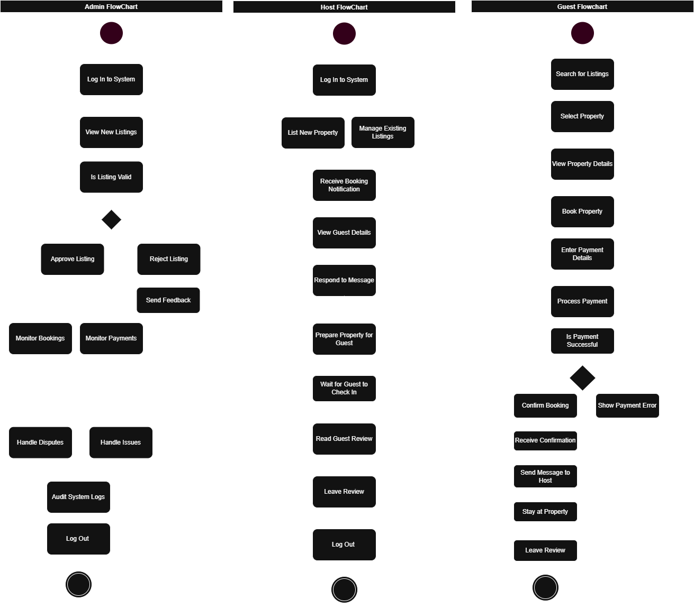

# Airbnb Clone - System Process Flowcharts

## Overview
Flowcharts documenting the core backend processes for the Airbnb Clone system, showing sequential workflows for administrators, hosts, and guests.

## Admin Process Flow

### Key Steps:
1. Listing validation and approval
2. Ongoing system monitoring
3. Dispute resolution
4. Security auditing

## Host Process Flow

### Key Steps:
1. Property listing management
2. Booking Communication
3. Guest interaction
4. Review exchange

## Guest Process Flow

### Key Steps:
1. Property discovery
2. Booking workflow
3. Payment processing
4. Post-stay review

## Technical Implementation

### Decision points
Represented by diamond shapes

### System Triggers
Booking confirmation → Database update
Payment failure → Error logging

### Integration Points:
Stripe API for payments
WebSocket for notifications

## Files

