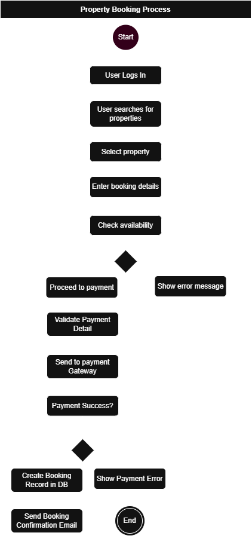

# 🔄 Flowchart: Property Booking Process

This flowchart visualizes the backend workflow for the **Property Booking** feature of the Airbnb backend system. It outlines the step-by-step process a guest follows to successfully book a property, and how the system handles this data internally.

---

## 🧩 Purpose

To clearly map out how different components interact during the booking process, from user login and property search to payment and confirmation.

---

## 📥 Key Steps in the Process

1. **User Login**  
2. **Property Search**  
3. **Booking Details Input**  
4. **Availability Check**  
5. **Payment Handling via Gateway**  
6. **Booking Record Creation**  
7. **Email Confirmation**

---

## 📂 File Structure

---

## 📌 Notes

- Designed using [Draw.io](https://draw.io)
- This diagram represents **one backend process** (booking). Other flowcharts can be added similarly.
- Suitable for onboarding developers and documenting system architecture.

---

## ✍️ Author

Created as part of the **ALX Airbnb Backend System** under the **Backend Engineering Track**.

