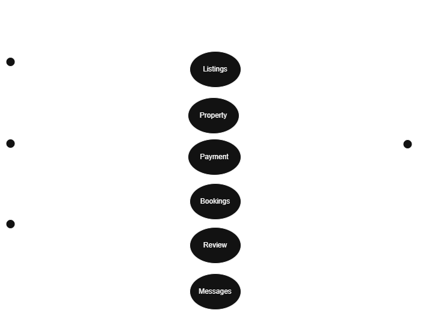

# Airbnb Backend System - Use Case Description

This use case diagram represents the core functionality of an **Airbnb Backend System**, illustrating how different actors interact with the system's main components.

## 📋 Use Case Description

The system supports three primary actors—**Admin**, **Guest**, and **Host**—alongside an external **Payment Gateway**. Each actor interacts with various backend services to perform their roles:

- **Admin** can:
  - Moderate property **Listings**

- **Guest** can:
  - Search **Properties**
  - Book **Listings**
  - Make **Payments**
  - Manage **Bookings**
  - Leave **Reviews**
  - Send **Messages** to Hosts

- **Host** can:
  - View **Bookings**
  - View **Reviews**
  - Respond to **Messages**

- **Payment Gateway**:
  - Processes and handles payments through the **Payment** system

## 🧩 Use Case Diagram

This use case diagram serves as a blueprint for developing and organizing backend features in an Airbnb-like application.

